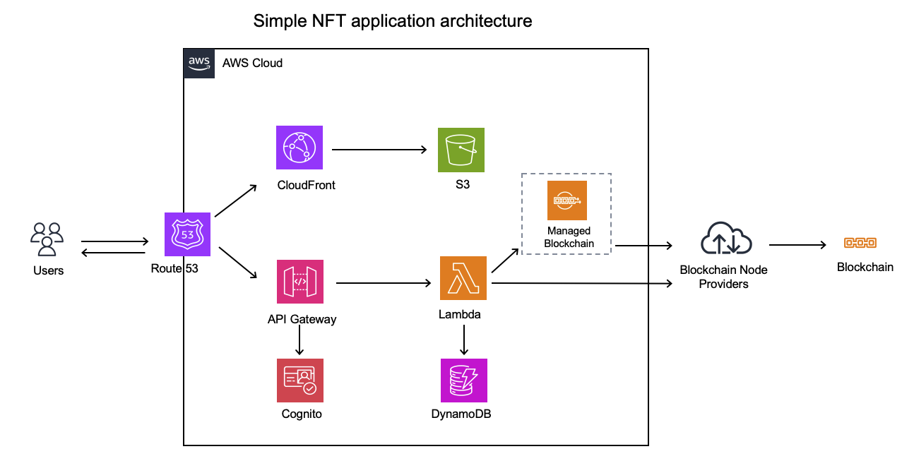

# Simple NFT dApp backend
This folder contains the backend code for Simple NFT dApp

## How to run 
```
npm install
npm run start or npm run start:dev on local
```

## How to test
This code has been deployed to Heroku. You can test it by calling the API below:
```
To mint:
curl -X POST -d "recipient"="Your Sepolia Ethereum account address" https://simple-nft-test-b736bcd4d7ca.herokuapp.com/mint

To get a NFT detail:
curl -X GET -d "user"="Your Sepolia Ethereum account address" https://simple-nft-test-b736bcd4d7ca.herokuapp.com/details
```

## TODO
```
1. Preferably in Typescript
=> Partially(in the middle of migration)

2. CRUD operations relating to your smart contract e.g. storing receipts of the NFTs
minted
=> Partially

3. Draw an architecture diagram of how you would design a cross-region support with
low latency built on AWS for your backend. Justify why you choose to use each
service/infrastructure
=> Done

4. Hosting of your dApp with vercel/heroku
=> Done
```

## Assignment 3) Draw an architecture diagram of how you would design a cross-region support with low latency built on AWS for your backend. Justify why you choose to use each service/infrastructure

### Simple NFT application architecture


### Summary
The Simple NFT application is composed of three layers. The first layer is the presentation layer, which is deployed on Amazon S3 and can be accessed via Amazon CloudFront. The middle layer is responsible for implementing the business logic and connecting the frontend client application to the blockchain network. In this architecture, the middle layer uses Amazon API Gateway, Amazon Cognito, and AWS Lambda to provide a solution with high security and scalability. By connecting this solution to other databases, it is possible to store data outside the blockchain network. The Lambda functions in this layer collaborate with Amazon Managed Blockchain or Blockchain Node Providers to send transactions to the blockchain network. Lastly, the third layer is the smart contract that implements the specifications of Simple NFT.

### Service selection
- **Presentation layer**
When hosting a static site on AWS, using S3 and CloudFront together allows for faster display speeds due to caching and the ability to support SSL for custom domains. CloudFront has edge servers (edge locations) around the world, and it can deliver cached content from the edge server closest to the client. While it is possible to use a custom domain with only S3, there is no place to deploy an SSL certificate in that case, and delivery via SSL/TSL is not possible. By using CloudFront, you can set up a certificate created with ACM (AWS Certificate Manager) on the distribution, making it possible to deliver content via SSL/TSL with a custom domain.

- **Middle layer**
This application has both administrators and users. While this sample application is built on a very simple mechanism, in a production system, it is necessary to implement user management features using AWS services like Amazon Cognito. Once authentication is complete, the request is processed. This application is simply saving the receipt when an NFT is minted, so there's no need for complex queries or constantly running servers. Therefore, I propose a serverless architecture using Amazon API Gateway, Amazon Lambda, and Amazon Dynamo.

The following are four main benefits of adopting a serverless approach:

1. No need for server management
When using servers with cloud services, it's necessary to select servers and storage and perform initial setup. With serverless, servers are allocated based on events just by preparing the necessary code.

2. Flexible scaling based on processing
In cloud services, you pre-size and secure the necessary instances. In serverless, computer resources and memory are automatically allocated based on the processing required.

3. Support for high availability
With cloud services, you need to consider error handling between applications and systems. In serverless, you can reduce manual work by setting up retry processes and event-driven operations.

4. No need to reserve resources when computer resources are not in use
In cloud services, you need to secure computer resources based on the service contract. With serverless, computer resources are allocated based on events, so you can expect cost optimization when there are variations in demand or when processing is concentrated at specific times.

- **Connection to blockchain network**
Currently, AWS Managed Blockchain only supports Hyperledger Fabric, Ethereum, and Bitcoin. Therefore, it's worth considering if you primarily use these chains. If you want to use a chain with superior performance, you will need to use external node providers. Additionally, in case one service goes down, it's also worth considering using multiple node providers.


